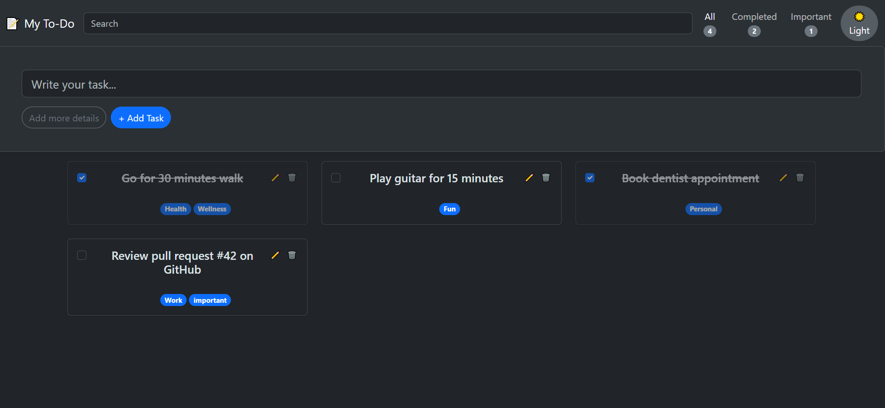
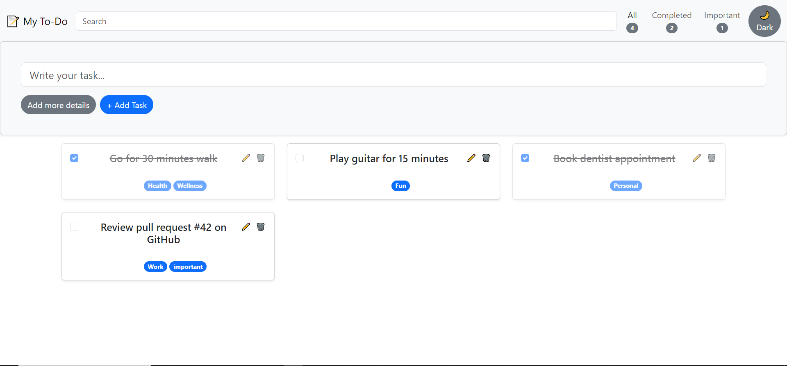
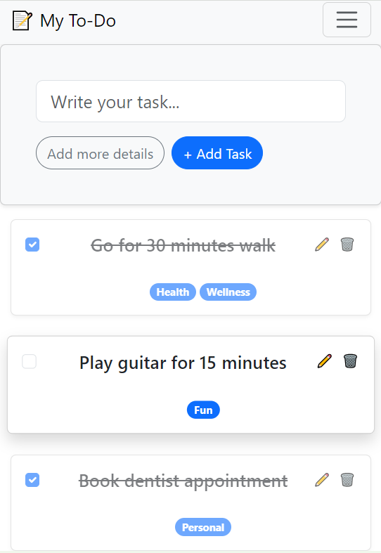

# 📝 My To-Do List

A feature-rich and responsive to-do list application built with React. It allows users to efficiently manage their tasks with features like tagging, filtering, searching, and theme customization. All data is saved locally in your browser.

 



---

## ✨ Features

- **Full CRUD Functionality**: Add, view, edit, and delete tasks.
- **Task Completion**: Mark tasks as complete or incomplete with a single click.
- **Powerful Filtering**:
  - View all tasks.
  - View only completed tasks.
  - View tasks tagged as "important".
- **Full-Text Search**: Instantly find tasks by searching their title or description.
- **Task Details**: Click on any task to see a dedicated detail view with its creation date.
- **Tagging System**: Organize tasks with custom tags (e.g., `work`, `personal`).
- **Persistent Storage**: Your tasks are automatically saved to the browser's Local Storage, so they'll be there when you come back.
- **Theming**: Switch between a comfortable Light Mode and a sleek Dark Mode. Your preference is saved automatically.
- **Responsive Design**: A clean and usable interface on both desktop and mobile devices, built with React-Bootstrap.

---

## 🛠️ Tech Stack

- **Frontend**: React
- **Routing**: React Router
- **UI Framework**: React-Bootstrap & Bootstrap 5
- **State Management**: React Hooks (`useState`, `useEffect`, `useMemo`) & Context API (`useTheme`)

---

## 🚀 Getting Started

Follow these instructions to get a copy of the project up and running on your local machine for development and testing purposes.

### Prerequisites

You need to have Node.js and npm (or Yarn) installed on your machine.

### Installation

1. **Clone the repository:**

   ```sh
   git clone https://github.com/MariamEzzat1/To-do-list-application.git
   ```

2. **Navigate to the project directory:**

   ```sh
   cd todo-list
   ```

3. **Install dependencies:**
   ```sh
   npm install
   ```

### Running the Application

To start the development server, run:

```sh
npm start
```

The application will open automatically in your default browser at `http://localhost:3000`.

---


## 📄 License

This project is licensed under the MIT License.
